# AureonCare Architecture Diagram

Comprehensive architecture diagrams for all components and infrastructure of the AureonCare healthcare practice management system.

> **Accuracy note.** These diagrams document what is **implemented in the code**, verified by reading the source. Several packages are declared in `package.json` but never imported; they are listed in §21 as *not implemented* rather than drawn as if they exist.

---

## 1. System Overview

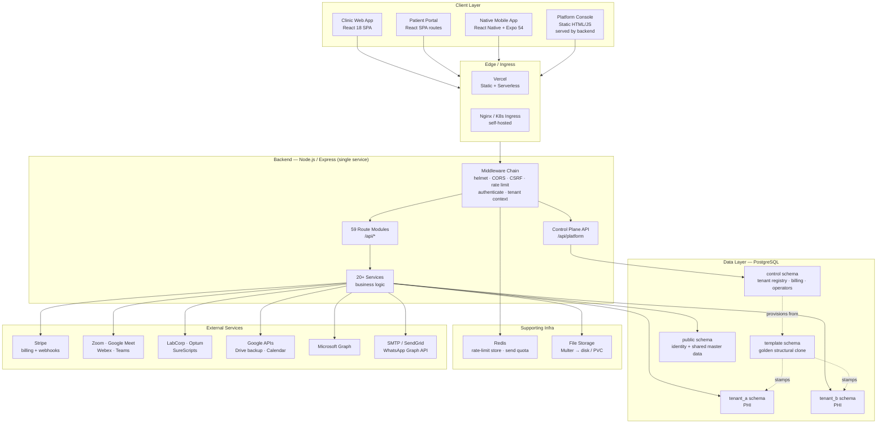

---

## 2. Multi-Tenancy Architecture (SEC-05 "Model D")

The single largest architectural change. Isolation is **schema-per-tenant**, enforced in application code plus a CI guard. There is **no Postgres Row-Level Security** anywhere in the codebase.

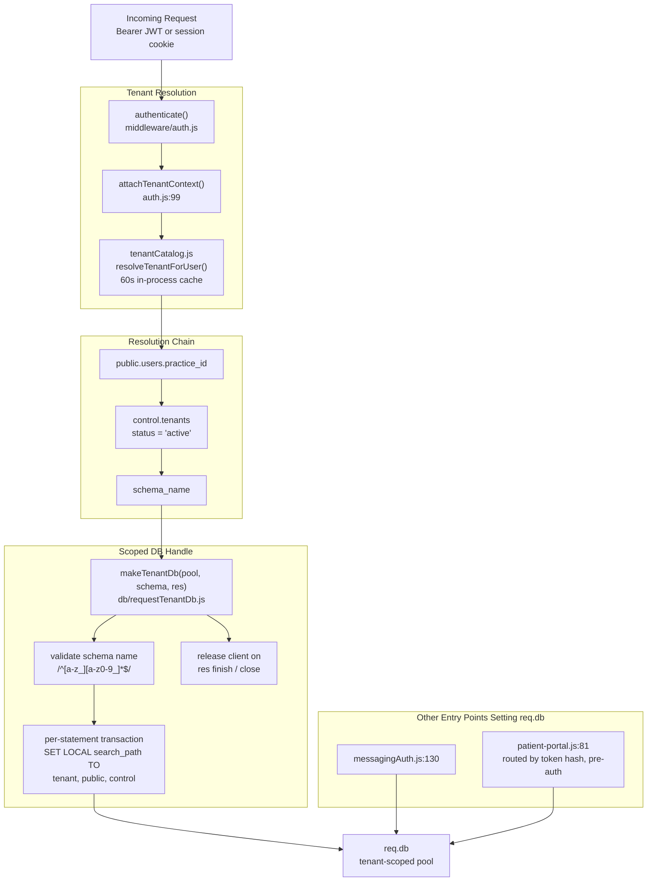

**Why per-statement `SET LOCAL`:** Supabase's transaction pooler can hand consecutive statements to different backends, so a connection-level `search_path` is unreliable. Each statement is wrapped in its own transaction with `SET LOCAL`.

**Fallback behaviour:** unresolved tenants fall back to `public`, which holds **no clinical tables** — so the fallback fails loudly and is logged as a broken account rather than silently leaking.

### Portal routing without a tenant context

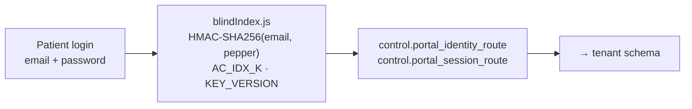

A blind index keeps the shared routing table from being a readable "which patient belongs to which clinic" map. Documented caveat in-file: this is a *coded identifier*, not de-identification under HIPAA Safe Harbor.

### Sweep coverage (honest status)

| Metric | Value |
|---|---|
| Route files using tenant-scoped `req.db` | 44 |
| Route files still using `app.locals.pool` directly | 56 |
| Enforcement | `backend/scripts/check-tenant-scoping.js` + explicit `RAW_POOL_ALLOWLIST` |
| Allowlist rationale | identity plane, shared master data, control-plane billing |
| CI gates | SEC-05 Tenant-Scoping Guard + Cross-Tenant Isolation Test |

> `SEC-05_MULTI_TENANCY_PLAN.md` is the design record for this work and is now marked **superseded**; its §0.1 carries the shipped-state summary. Read it for *why* Model D was chosen over app-only scoping or RLS — not as a description of the system.

---

## 3. Database Schema Topology

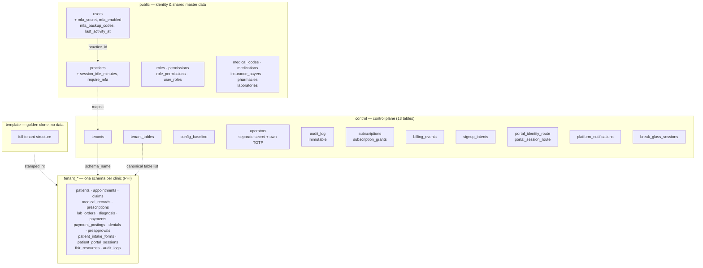

### Migration tracks

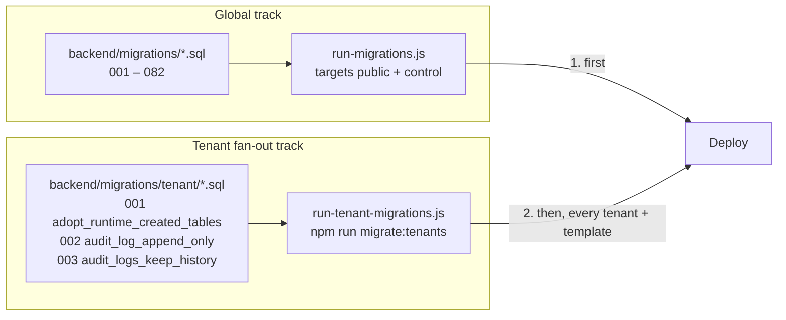

Each tenant schema tracks applied versions in its own `<schema>.schema_migrations`, so the runner is idempotent and a safe no-op when the directory is empty.

---

## 4. Backend Architecture

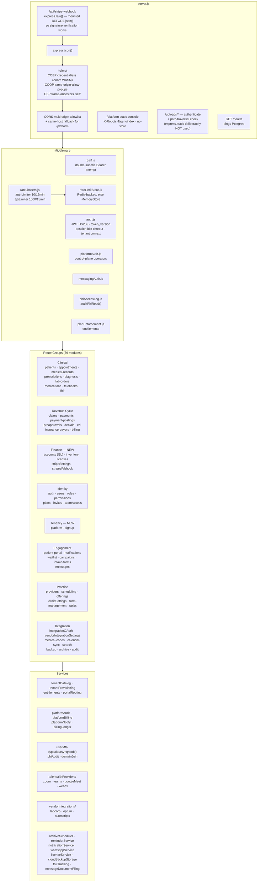

### New route modules

| Route | Mount | Purpose |
|---|---|---|
| `platform.js` | `/api/platform` | Control-plane console API — tenant fleet, subscriptions, break-glass. Operators authenticate against `control.operators` with a **separate secret and their own TOTP**. |
| `signup.js` | `/api/signup` | Public self-serve signup — plan selection, coupon preview, Stripe checkout. Two-phase commit across DB + Stripe. |
| `invites.js` | `/api/invites` | Staff invites; binds OAuth-created accounts to a practice (closes the `practice_id IS NULL` → `public` hole). |
| `teamAccess.js` | `/api/team-access` | Verified email-domain claims, self-service join requests with admin approval, **and security-policy endpoints**. |
| `messages.js` | `/api/messages` | Secure messaging — care-team and patient threads, attachments, AES-256-GCM at rest. |
| `accounts.js` | `/api/accounts` | Accounting / general ledger. |
| `inventory.js` | `/api/inventory` | Inventory management. |
| `licenses.js` | `/api/licenses` | Provider license tracking. |
| `stripeSettings.js` | `/api/stripe-settings` | Stripe configuration. |
| `stripeWebhook.js` | `/api/stripe-webhook` | Raw-body webhook receiver for signature verification. |

---

## 5. Frontend Architecture

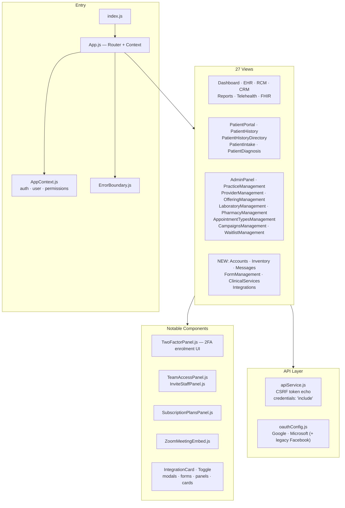

**Build:** React 18 + CRA/craco + Tailwind CSS. `@zoom/meetingsdk`, `jspdf`/`jspdf-autotable`, `xlsx`, `date-fns`, `lucide-react`, `@azure/msal-*`, `@react-oauth/google`.

### Platform console — a deliberately separate UI

`backend/public/platform/{index.html, console.js, console.css}` is served as **static files by the backend** at `/platform`, with `X-Robots-Tag: noindex` and `Cache-Control: no-store`. It is intentionally not part of the React SPA so operator code never ships in a clinic user's bundle.

---

## 6. Mobile App Architecture

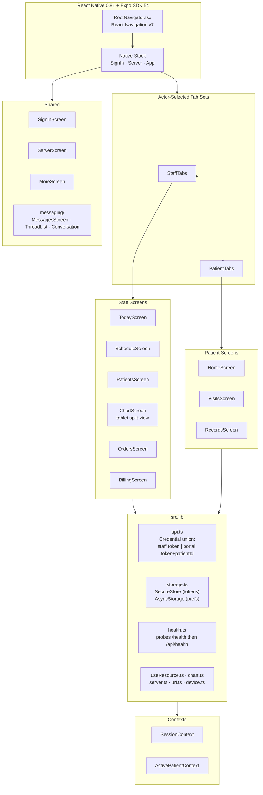

- Native app (not a webview wrapper), `newArchEnabled: true`, bundle IDs `tech.aureoncare.app` (iOS + Android).
- Both credential kinds ride the same `Authorization: Bearer` header; only `/patient-portal/*` is portal-only.
- Tests: `mobile/tests/*.test.mjs` (node:test).

> Biometric unlock, push notifications and native OAuth are **described in `mobile/README.md` but not implemented** — see §21.

---

## 7. Authentication & Authorization Flow

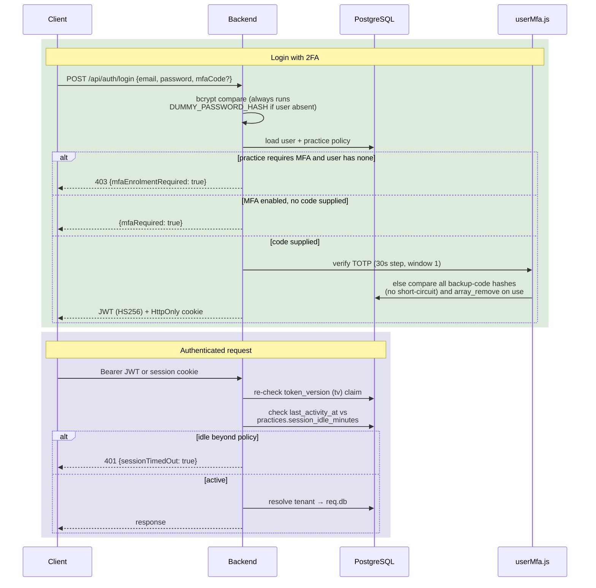

| Control | Detail |
|---|---|
| **TOTP 2FA** | `speakeasy` + `qrcode`; 30s step, `window: 1` (±30s skew). Two-phase enrolment — secret stored, `mfa_enabled` stays false until a code verifies. |
| **Backup codes** | 10 codes, SHA-256 hashed, single-use, struck via `array_remove` before the session is issued. Verification compares against every hash without short-circuiting, so timing can't leak how many remain. |
| **Session idle timeout** | Server-enforced. `practices.session_idle_minutes` (CHECK 5–1440, NULL = unlimited). Activity stamp refreshed at most once per 60s to avoid a per-request row lock. |
| **Token revocation** | `token_version` (`tv`) claim re-checked against the DB every request; bumping it revokes all prior tokens. |
| **Algorithm pinning** | JWT pinned to `HS256`; startup **throws** if `AC_TK_S` < 32 bytes. |
| **Role integrity** | `requireAdmin` re-fetches role from the DB — never trusts the JWT role claim. |
| **Policy management** | `GET/PATCH /api/team-access/security-policy`; PATCH refuses `require_mfa=true` with 409 while any admin lacks 2FA. |

**MFA endpoints:** `/mfa/status`, `/mfa/enroll`, `/mfa/verify`, `/mfa/disable`, `/mfa/backup-codes`.

### OAuth

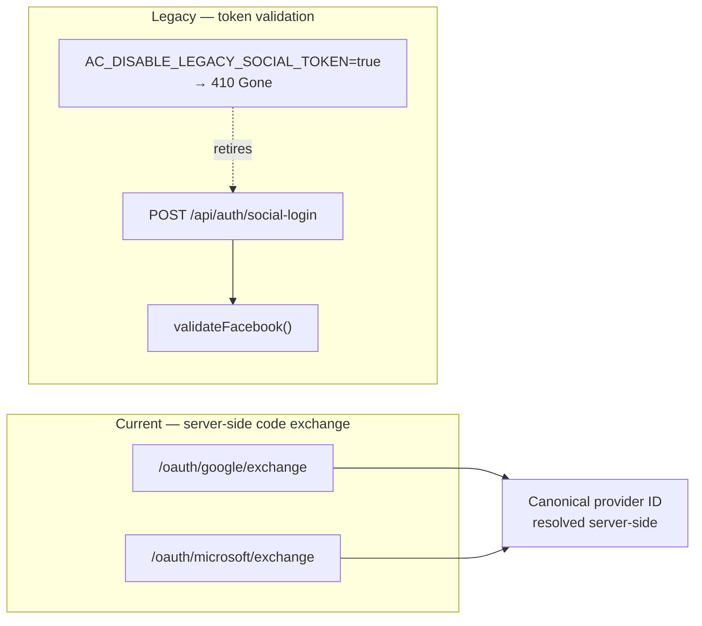

Facebook is reachable **only** through the legacy endpoint, which a single env var retires. Treat it as deprecated, not a supported path.

---

## 8. RBAC Permission Model

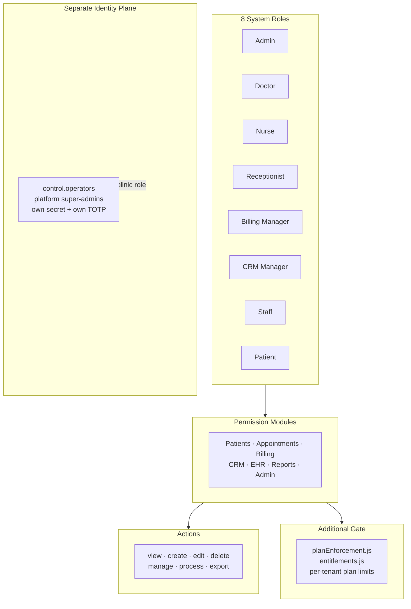

Clinic RBAC and platform-operator access are **entirely separate identity planes** — an Admin in a clinic has no path to the control plane.

---

## 9. Clinical Data Flow

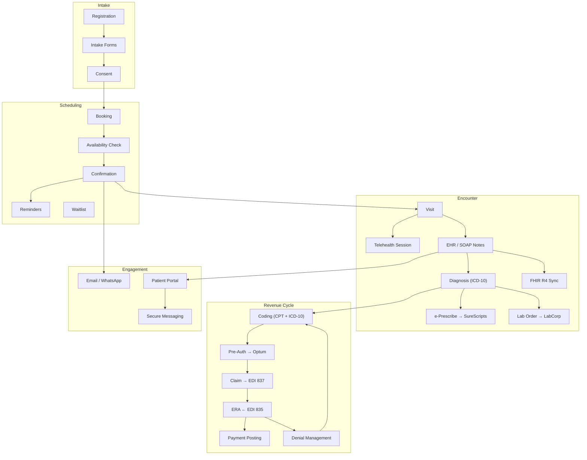

---

## 10. Billing & Subscription Architecture (Stripe)

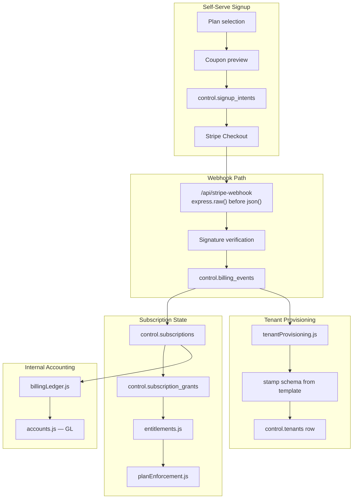

Signup is a **two-phase commit across the database and Stripe**. `platformBilling.js` is the only consumer of the `stripe` SDK.

---

## 11. Telehealth Integration

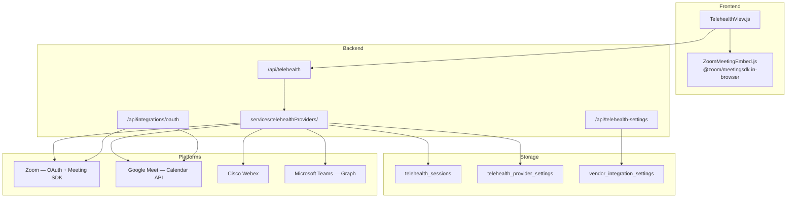

Zoom's in-browser SDK is why `helmet` sets COEP `credentialless` and COOP `same-origin-allow-popups` — the WASM runtime requires it.

---

## 12. FHIR R4 & Vendor Integrations

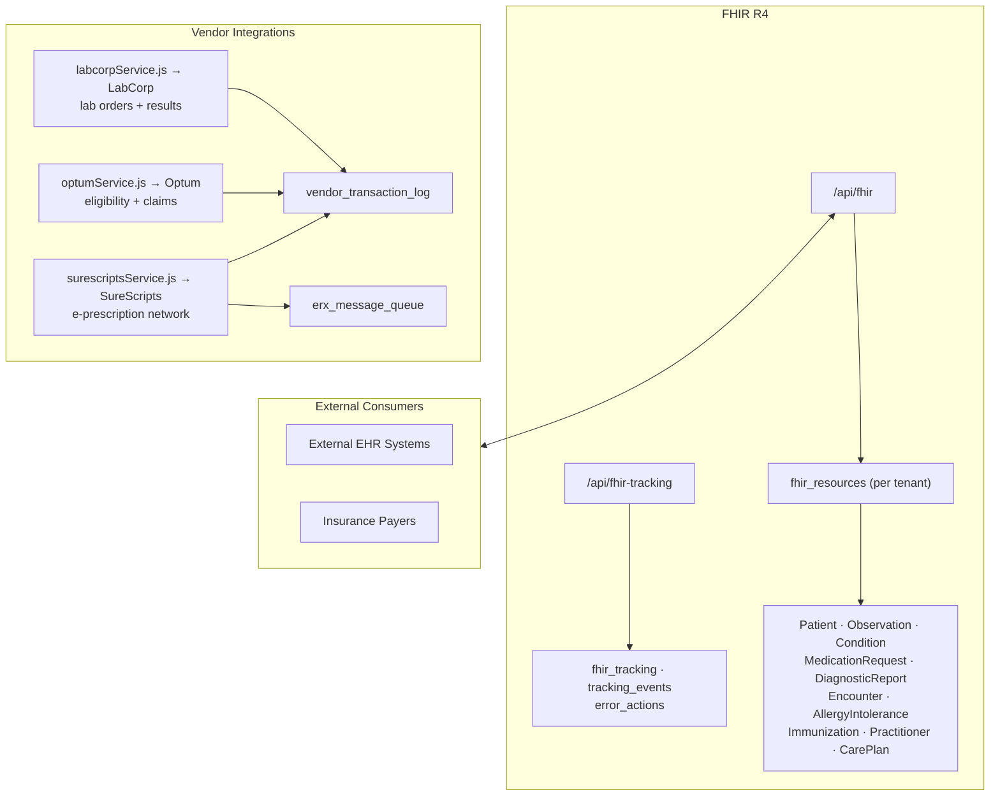

**Standards:** FHIR R4, HL7 v2 / EDI 837 + 835, ICD-10, CPT.

---

## 13. Messaging & Notifications

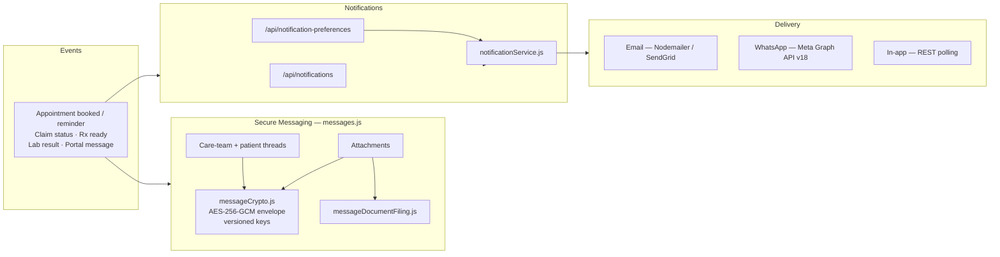

> **Delivery is poll-based REST, not push.** There is no WebSocket or SSE transport — `MessagesView.js` and the mobile `useResource.ts` fetch on interval/refresh. Message bodies are encrypted at rest but this is explicitly **not** end-to-end encryption; the rationale is documented in `messageCrypto.js`.

---

## 14. Deployment & Infrastructure

AureonCare now targets **three deployment models** from one codebase.

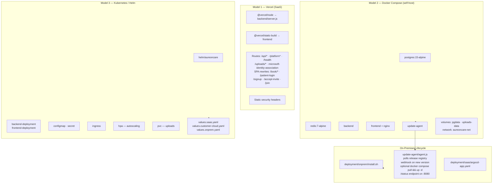

**Health check:** exactly one endpoint — `GET /health` (`backend/server.js:127`), pinging Postgres. Referenced by `vercel.json`, both Helm probes, and the compose healthcheck. There is **no `/api/health`**; the mobile client probes `['/health', '/api/health']` in order purely as proxy tolerance.

**Redis status:** live for the rate-limit store and send quota when `AC_RD_H`/`AC_RD_URL` are set. The `redisClient` in `server.js` is **commented out**, so `/health` reports Redis as `"not configured"` even when the rate limiter is using it.

---

## 15. CI/CD Pipeline

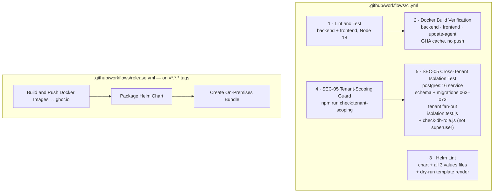

**Backend test suites** (`backend/test/`): `sec05/isolation.test.js`, and `signup/{flow, plan-change, billing, accounting, notify, domain-join, mfa-session}.test.js` — wired to `test:sec05`, `test:signup`, `test:plans`, `test:billing`, `test:accounting`, `test:notify`, `test:domains`, `test:mfa`.

---

## 16. Security Architecture

```mermaid
graph TB
    subgraph Net["Network / Transport"]
        HELMET["helmet — COEP · COOP · CSP frame-ancestors"]
        CORSX["CORS allowlist + /platform fallback"]
        RATE["Rate limiting — Redis-backed store"]
        TLS["TLS at edge (Vercel / ingress)"]
    end

    subgraph App["Application"]
        CSRFX["CSRF double-submit"]
        JWTX["JWT HS256 pinned · 32-byte secret enforced<br/>token_version revocation"]
        MFAX["TOTP 2FA + hashed backup codes"]
        IDLE["Server-enforced session idle timeout"]
        PWD["Password policy — 12+ chars, 4 classes<br/>bcrypt cost 12"]
        TIMING["DUMMY_PASSWORD_HASH<br/>constant-time login"]
        LOCK["Portal lockout — 20/IP + 3/account per 15min"]
        UPLOADX["Authenticated uploads<br/>+ path-traversal check"]
    end

    subgraph Data["Data"]
        TENANTX["Schema-per-tenant isolation<br/>+ CI guard"]
        MSGENC["AES-256-GCM message envelope"]
        BAKENC["backupCrypto.js"]
        BLIND["Blind index — HMAC-SHA256 + pepper"]
        HASHSESS["Portal session tokens SHA-256 hashed"]
        LEASTP["aureoncare_app least-privilege role<br/>CI asserts not superuser"]
    end

    subgraph Audit["Audit & Compliance"]
        PHIA["PHI read trail — phiAccessLog + phiAudit<br/>logs resource, not payload; 2xx only"]
        APPEND["Append-only audit_logs<br/>BEFORE UPDATE/DELETE trigger raises"]
        CIMM["control.audit_log immutable"]
        BGLASS["break_glass_sessions"]
        STD["FHIR R4 · HL7 · ICD-10 · CPT"]
    end

    Net --> App --> Data --> Audit
```

**Not present:** Row-Level Security (zero policies), dedicated secrets-manager integration, WAF configuration. Staff login has no `failed_login_count`/`locked_until` columns — account lockout is portal-only; staff rely on the generic `authLimiter`.

---

## 17. Component Summary

| Layer | Technology | Status |
|---|---|---|
| **Clinic web** | React 18, CRA/craco, Tailwind, React Router v6 | Active |
| **Mobile** | React Native 0.81, Expo SDK 54, React Navigation v7, TypeScript | Active |
| **Platform console** | Static HTML/JS served by backend at `/platform` | Active |
| **Backend** | Node.js 18, Express 4, 59 route modules, 20+ services | Active |
| **Database** | PostgreSQL — `public` + `control` + `template` + per-tenant schemas | Active |
| **Tenancy** | Schema-per-tenant, `search_path` pinned per statement | Active |
| **Cache** | Redis — rate-limit store + send quota | Partial (client commented out in `server.js`) |
| **Auth** | JWT HS256, HttpOnly cookie, TOTP 2FA, idle timeout | Active |
| **Social auth** | Google + Microsoft code exchange | Active |
| **Social auth (legacy)** | Facebook via `/social-login` | Deprecated — retired by env var |
| **Billing** | Stripe Checkout + webhooks, internal GL | Active |
| **Messaging** | REST polling, AES-256-GCM at rest | Active |
| **Telehealth** | Zoom SDK, Google Meet, Webex, Teams | Active |
| **Vendors** | LabCorp, Optum, SureScripts | Active |
| **Interop** | FHIR R4, HL7 v2 / EDI 837+835, ICD-10, CPT | Active |
| **Containers** | Docker (backend, frontend, update-agent) | Active |
| **Orchestration** | Helm chart, 3 values profiles, HPA, ingress, PVC | Active |
| **On-prem** | `install.sh` + auto-update agent | Active |
| **CI/CD** | GitHub Actions — 5 CI jobs, tagged releases to ghcr.io | Active |

---

## 18. Declared But **Not Implemented**

These appear in dependency manifests or prose documentation but have **zero imports in the codebase**. They are recorded here so the diagrams above are not read as claiming them.

| Item | Reality |
|---|---|
| `socket.io` (root `package.json`) | **0 usages.** No WebSocket/SSE anywhere. `server.js` calls plain `app.listen()` and never creates an `http.Server` to attach to. Messaging is poll-based REST. |
| `winston` | **0 requires.** All logging is `console.*`. |
| `joi` | **0 requires.** Validation is hand-rolled. |
| Row-Level Security | **No policies exist.** Isolation is schema + `search_path`, enforced in app code and CI. |
| Redis client in `server.js` | **Commented out.** Redis is genuinely used by the rate-limit store, but `/health` reports `"not configured"`. |
| `expo-local-authentication` (biometric unlock) | Declared in mobile, **0 imports**. A `biometrics` preference key exists in `storage.ts` but nothing reads the biometric API. |
| `expo-notifications` (push / APNs / FCM) | Declared in mobile, **0 imports**. |
| `expo-auth-session` / `expo-web-browser` | Declared in mobile, **0 imports**; `app.json` client IDs are empty placeholders. |
| `expo-document-picker`, `expo-crypto`, `expo-linking`, `react-native-svg` | Declared in mobile, **0 imports** (RN's own `Linking` is used). |
| Backend `@azure/msal-*`, `@react-oauth/google`, `react` | Frontend dependencies leaked into the backend manifest; **0 backend requires**. |

`mobile/README.md` cites biometrics, push notifications and deep links as *motivation for choosing React Native* — that is rationale, not shipped functionality.
