# AureonCare Architecture Diagram

This document provides comprehensive architecture diagrams for all components and infrastructure of the AureonCare healthcare practice management system.

---

## 1. System Overview

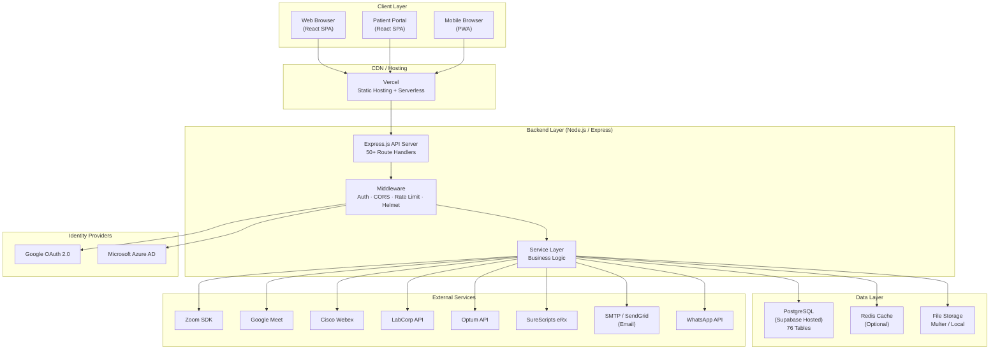

---

## 2. Frontend Architecture

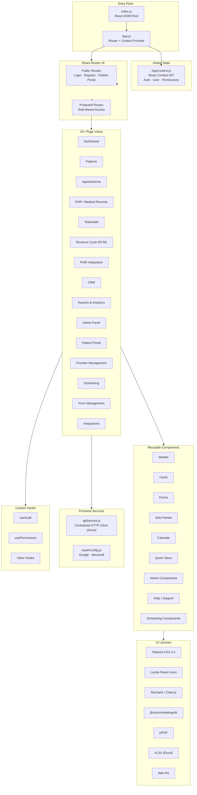

---

## 3. Backend Architecture

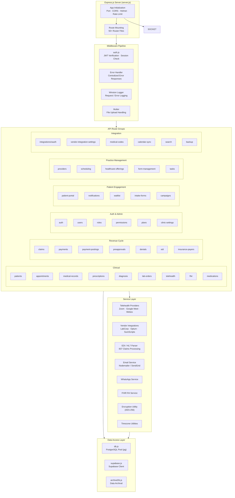

---

## 4. Database Schema Overview

```mermaid
erDiagram
    users ||--o{ user_roles : has
    users ||--o{ social_auth : has
    users ||--o{ audit_logs : generates
    roles ||--o{ user_roles : assigned_via
    roles ||--o{ role_permissions : has
    permissions ||--o{ role_permissions : granted_via

    patients ||--o{ appointments : books
    patients ||--o{ medical_records : has
    patients ||--o{ prescriptions : receives
    patients ||--o{ diagnosis : has
    patients ||--o{ lab_orders : orders
    patients ||--o{ claims : generates
    patients ||--o{ payments : makes
    patients ||--o{ telehealth_sessions : attends
    patients ||--o{ patient_allergies : has
    patients ||--o{ patient_pharmacies : prefers
    patients ||--o{ fhir_resources : has
    patients ||--o{ notifications : receives

    providers ||--o{ appointments : conducts
    providers ||--o{ telehealth_sessions : hosts
    providers ||--o{ doctor_availability : has
    providers ||--o{ doctor_time_off : takes
    providers ||--o{ prescriptions : writes

    appointments ||--o{ appointment_reminders : triggers
    appointments ||--o{ claims : generates

    claims ||--o{ claim_submissions : tracked_via
    claims ||--o{ payment_postings : reconciled_via
    claims ||--o{ denials : may_have

    payments ||--o{ payment_postings : posted_via

    healthcare_offerings ||--o{ offering_pricing : has
    healthcare_offerings ||--o{ offering_packages : bundled_in
    healthcare_offerings ||--o{ offering_insurance_mappings : covered_by
```

---

## 5. Database Domain Map

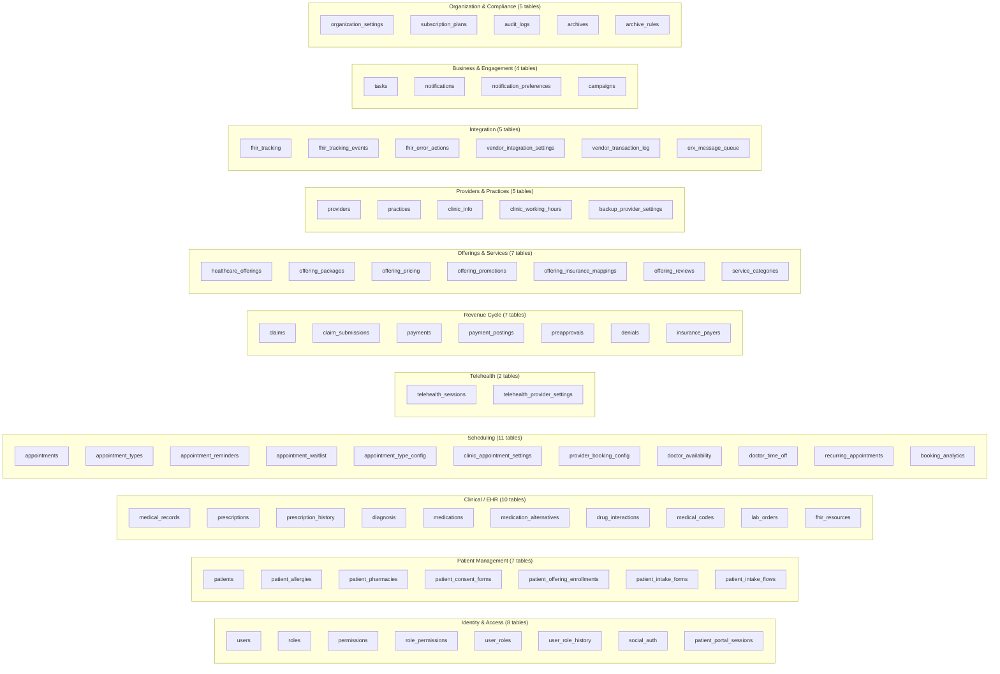

---

## 6. Authentication & Authorization Flow

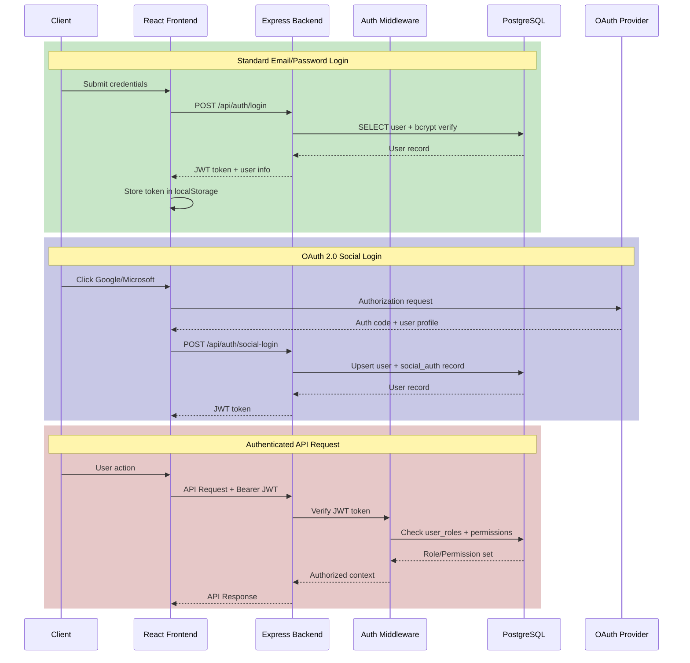

---

## 7. RBAC Permission Model

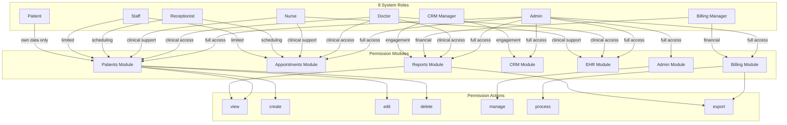

---

## 8. Clinical Data Flow

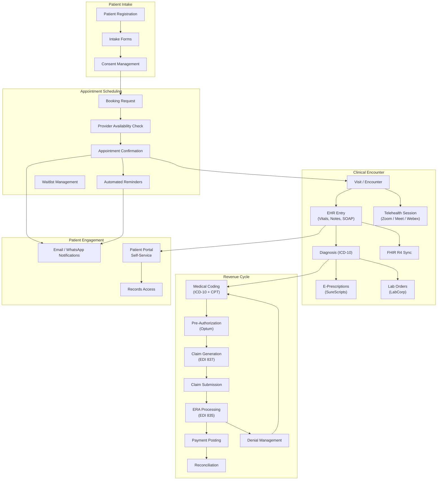

---

## 9. Telehealth Integration Architecture

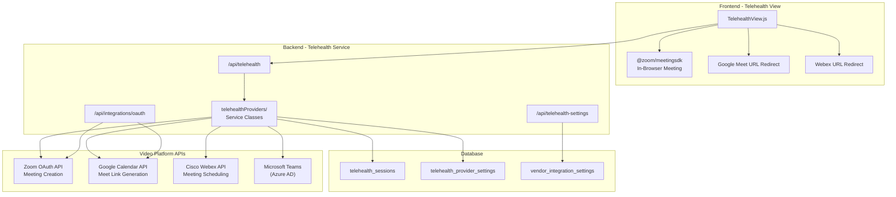

---

## 10. Revenue Cycle Management (RCM) Flow

```mermaid
flowchart LR
    subgraph Eligibility["Eligibility Verification"]
        INS_CHECK["Insurance Payer Lookup"]
        ELIG_API["Optum Eligibility API"]
        ELIG_RESULT["Eligibility Result"]
    end

    subgraph PreAuth["Pre-Authorization"]
        PREAUTH_REQ["Pre-Auth Request"]
        PREAUTH_DB["preapprovals table"]
        PREAUTH_RESP["Auth Decision"]
    end

    subgraph Claims["Claim Processing"]
        CLAIM_GEN["Claim Generation<br/>(CPT + ICD-10 codes)"]
        EDI_837["EDI 837 Formatting<br/>(HL7 Parser)"]
        CLAIM_SUB["Claim Submission<br/>claim_submissions table"]
        CLAIM_TRACK["Claim Tracking<br/>claims table"]
    end

    subgraph Payments["Payment Processing"]
        ERA_835["EDI 835<br/>Remittance Advice"]
        PAY_POST["Payment Posting<br/>payment_postings table"]
        PAY_RECORD["Payment Record<br/>payments table"]
        RECONCILE["Reconciliation<br/>Reports"]
    end

    subgraph Denials["Denial Management"]
        DENIAL_RECV["Denial Receipt"]
        DENIAL_TRACK["Denial Tracking<br/>denials table"]
        APPEAL["Appeal / Resubmission"]
    end

    INS_CHECK --> ELIG_API --> ELIG_RESULT
    ELIG_RESULT --> PREAUTH_REQ
    PREAUTH_REQ --> PREAUTH_DB --> PREAUTH_RESP
    PREAUTH_RESP --> CLAIM_GEN
    CLAIM_GEN --> EDI_837
    EDI_837 --> CLAIM_SUB
    CLAIM_SUB --> CLAIM_TRACK
    CLAIM_TRACK --> ERA_835
    ERA_835 --> PAY_POST
    ERA_835 --> DENIAL_RECV
    PAY_POST --> PAY_RECORD
    PAY_RECORD --> RECONCILE
    DENIAL_RECV --> DENIAL_TRACK
    DENIAL_TRACK --> APPEAL
    APPEAL --> CLAIM_GEN
```

---

## 11. FHIR R4 Integration Architecture

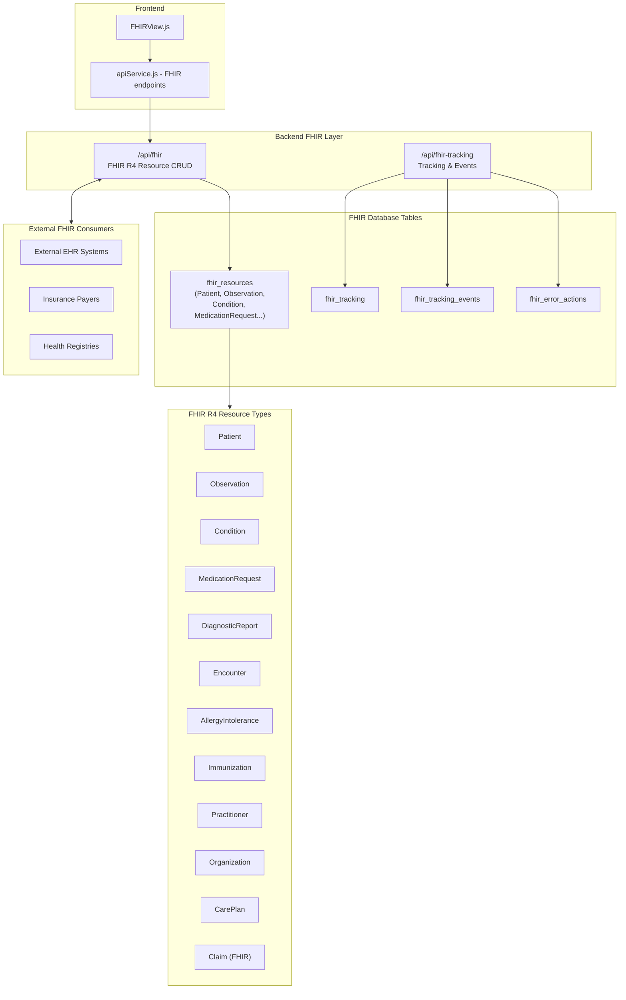

---

## 12. Vendor Integration Architecture

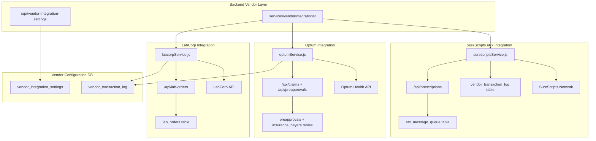

---

## 13. Notification & Communication Architecture

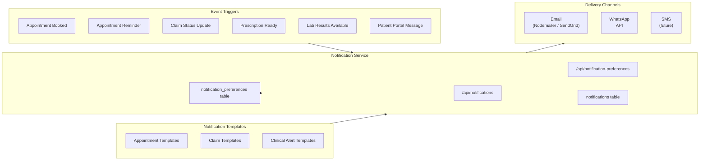

---

## 14. Deployment & Infrastructure Architecture

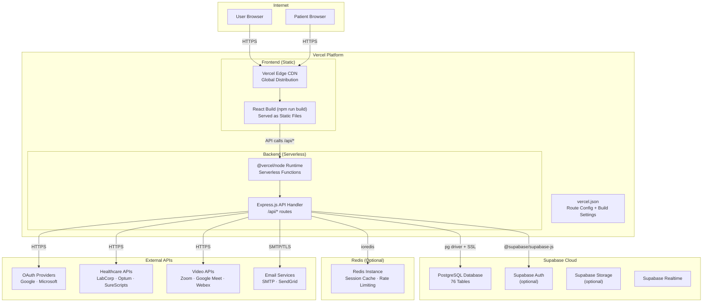

---

## 15. Security Architecture

```mermaid
graph TB
    subgraph Network["Network Security"]
        HELMET["Helmet.js<br/>HTTP Security Headers"]
        CORS_SEC["CORS Policy<br/>Allowed Origins Only"]
        RATELIMIT["Rate Limiting<br/>express-rate-limit"]
        HTTPS_ENF["HTTPS Enforcement<br/>(Vercel TLS)"]
    end

    subgraph AppSecurity["Application Security"]
        JWT_AUTH["JWT Authentication<br/>HS256 Signed Tokens"]
        BCRYPT["bcryptjs<br/>Password Hashing"]
        AES["AES-256 Encryption<br/>Sensitive Data at Rest"]
        RBAC_SEC["RBAC Authorization<br/>Role + Permission Checks"]
        INPUT_VAL["Input Validation<br/>Joi Schema Validation"]
        SQL_PARAM["Parameterized Queries<br/>SQL Injection Prevention"]
    end

    subgraph DataSecurity["Data Security"]
        PG_SSL["PostgreSQL SSL<br/>Encrypted Connections"]
        ENV_VARS["Environment Variables<br/>No Secrets in Code"]
        AUDIT_LOG["Audit Logging<br/>All Data Changes Tracked"]
        ARCHIVE["Data Archival<br/>Retention Policies"]
    end

    subgraph Compliance["Healthcare Compliance"]
        FHIR_COMP["FHIR R4 Compliance<br/>Interoperability Standard"]
        HL7_COMP["HL7 v2 / EDI<br/>Claims Standards"]
        ICD_CPT["ICD-10 + CPT Codes<br/>Clinical Standards"]
        AUDIT_TRAIL["Complete Audit Trail<br/>audit_logs table"]
    end

    Network --> AppSecurity
    AppSecurity --> DataSecurity
    DataSecurity --> Compliance
```

---

## 16. Data Flow Summary

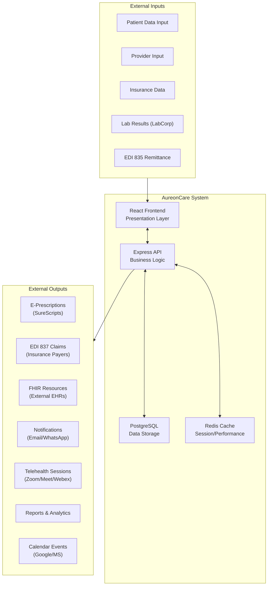

---

## Component Summary Table

| Layer | Technology | Purpose |
|-------|-----------|---------|
| **Frontend** | React 18.2 + Tailwind CSS | SPA Web Application |
| **State Management** | React Context API | Global App State |
| **Routing** | React Router v6 | Client-Side Navigation |
| **API Client** | Axios | HTTP Communication |
| **Charts** | Recharts + Chart.js | Analytics Visualization |
| **PDF/Excel** | jsPDF + XLSX | Document Export |
| **Video SDK** | @zoom/meetingsdk | In-Browser Telehealth |
| **Backend** | Node.js + Express.js 4.x | REST API Server |
| **Authentication** | JWT + bcryptjs | Auth Tokens + Hashing |
| **Authorization** | Custom RBAC Middleware | Role/Permission Checks |
| **Social Auth** | Google + MS MSAL OAuth | SSO Integration |
| **Database** | PostgreSQL 12+ (Supabase) | Primary Data Store |
| **Cache** | Redis 6+ | Session + Performance Cache |
| **File Storage** | Multer + Local/Cloud | Document Uploads |
| **Email** | Nodemailer + SendGrid | Transactional Email |
| **Hosting** | Vercel (Frontend + Backend) | Cloud Deployment |
| **Lab Integration** | LabCorp API | Lab Order Management |
| **Insurance** | Optum API | Claims + Eligibility |
| **e-Prescriptions** | SureScripts | Electronic Prescriptions |
| **Telehealth** | Zoom + Google Meet + Webex + Teams | Video Consultations |
| **Interoperability** | FHIR R4 + HL7 v2/EDI | Healthcare Standards |
| **Compliance** | Audit Logs + AES-256 | HIPAA-Aligned Controls |
| **Security** | Helmet + CORS + Rate Limiting | Network Protection |
